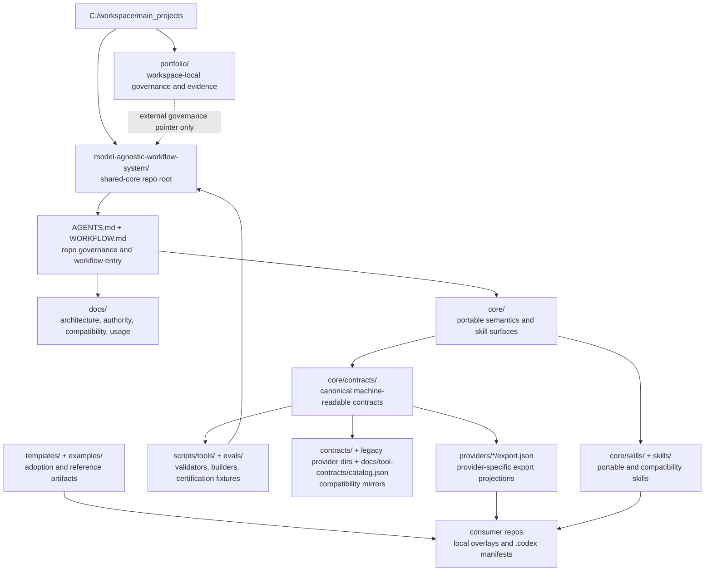

# model-agnostic-workflow-system

Provider-neutral shared-core repository for governed agentic workflow artifacts.  
This repository is a core, contract, export, and validation system, not an end-user product.

## What This Repository Is

This repo bundles reusable, provider-neutral workflow building blocks and the governance around them:

- portable skills and skill metadata
- machine-readable contracts and registry snapshots
- provider adapter exports (canonical and compatibility)
- validators, build scripts, and certification evals
- templates and examples for adoption
- repo-local orchestration skills for routing and surface decisions

Primary audiences:

- maintainers of this shared core
- consumer repositories adopting the core
- provider and adapter authors maintaining exports and packaging boundaries

## What This Repository Is Not

- not a single product app or end-user UI
- not a Codex-only repository
- not a provider-specific monolith
- not a replacement for consumer-local governance or overlay files
- not evidence of live runtime readiness unless validator-backed or artifact-backed

## System Model / Architecture At A Glance

1. Portable Core: semantics, skills, contracts, and the neutral registry in `core/`.
2. Compatibility Mirrors: transition and compatibility surfaces for older consumers in `skills/`, `contracts/`, legacy `providers/*`, and `docs/tool-contracts/catalog.json`.
3. Provider Exports: generated provider-specific bundles under `providers/<provider>/export.json`.
4. Governance and Authority: documented class logic and claim logic in `docs/architecture.md` and `docs/authority-matrix.md`.
5. Enforcement and Gates: validators and evals under `scripts/tools/` and `evals/`.
6. Workflow Entry: root workflow guidance in `WORKFLOW.md` plus repo-local routing skills under `.agents/skills/`.

Important: the class model (`canonical`, `operational`, `derived`, `archive`) is logical only. It does not imply a physical directory split by class.

## Local Root Representation And Data Flow

This is an orientation view of this repository root as the active shared-core node under `C:\workspace\main_projects`. It does not replace the authority model in `AGENTS.md`, `WORKFLOW.md`, `docs/architecture.md`, or `docs/authority-matrix.md`.

Data flow:

1. Work enters through `AGENTS.md` and `WORKFLOW.md`, which identify the governing sources, workflow class, validation posture, and stop conditions.
2. Canonical shared semantics are changed in `core/contracts/*`, `core/skills/*`, and policy surfaces when the change is reusable and provider-neutral.
3. Registry and compatibility projections are regenerated through the builder scripts when canonical contract inputs change.
4. Provider exports under `providers/*/export.json` are derived packaging projections, not second canonical sources.
5. Consumer repositories adopt the shared core through local overlays, `.codex` manifests, and repo-local documentation while keeping their own product, runtime, and evidence authority.
6. Validators and evals check repository consistency and certification fixtures; they do not create runtime readiness unless a concrete runnable path or generated artifact proves it.
7. The external portfolio layer may route workspace-local governance and evidence back to this repo, but portfolio rules remain outside this shared-core repository.

## Repository Structure (Meaning Of The Main Directories)

- `core/`  
  Provider-neutral core surface for skills, contracts, core eval scaffolding, and overlay boundary notes.

- `core/contracts/`  
  Canonical machine-readable contracts:
  - `core-registry.json` for the neutral registry snapshot
  - `workflow-routing-map.json` for workflow class to skill/tool/MCP/output/validation mapping
  - `provider-capabilities.json`
  - `output-contracts.json`
  - `tool-contracts/catalog.json`
  - `portable-skill-manifest.json`

- `contracts/`  
  Compatibility mirrors, including registry and capability mirrors during migration.

- `providers/`  
  Adapter boundary and export bundles:
  - canonical adapters: `openai-codex`, `anthropic-claude`, `qwen-code`, `kimi-k2_5`
  - legacy compatibility mirrors: `openai`, `anthropic`, `qwen`, `kimi`, `codex`

- `docs/`  
  Governance, authority, boundary, and operations documentation.

- `evals/`  
  Deterministic certification fixtures and the eval catalog in `evals/catalog.json`.

- `scripts/tools/`  
  Validators, registry builders, export builders, and helper scripts.

- `.agents/skills/`  
  Repo-local control-plane skills for routing and surface decisions, not portable shared skills.

- `skills/`  
  Legacy compatibility and contract-bound shared skills, including shared-with-local-inputs patterns.

- `templates/`  
  Reusable templates such as `templates/codex-workflow/`, `templates/discord-fetch-mcp/`, and `templates/qwen-bootstrap/`.

- `examples/`  
  Example artifacts and small reference examples.

## Authority And Governance Model

Normative entry points:

- Root operating contract: `AGENTS.md`
- Root workflow contract: `WORKFLOW.md`
- Documentation hierarchy and rules: `docs/architecture.md`
- Claim and status ledger: `docs/authority-matrix.md`
- Source hierarchy: `docs/governance/source-hierarchy.md`
- MCP boundary policy: `docs/mcp/policy.md`

Documentation classes:

- `canonical`
- `operational`
- `derived`
- `archive`

Important: documentation class and enforcement status are separate.  
A canonical statement is not automatically script-enforced. Enforced truth lives in validators and scripts.

Practical rule:

- when prose and validator behavior conflict, the enforcement surface wins, and the status should be made explicit in `docs/authority-matrix.md`

Capability maturity labels:

- `prose-governed`
- `contract-backed`
- `validator-backed`
- `runtime-implemented`

These labels describe maturity, not the claim-status values used in the authority matrix.

## Portable Core vs Compatibility Mirrors vs Provider Exports

- Portable Core (`core/`)  
  Home of shared semantics and neutral contracts.

- Compatibility Mirrors (`skills/`, `contracts/`, legacy provider directories, `docs/tool-contracts/catalog.json`)  
  Stability and migration surfaces for existing consumers, not the primary home for new shared semantics.

- Provider Exports (`providers/<provider>/export.json`)  
  Generated packaging and transport projections from the neutral registry and provider capability profiles.

Boundary rule:

- change shared semantics in the core
- keep provider-specific packaging projection in `providers/`
- keep backward compatibility explicitly marked as mirror behavior
- treat `core/contracts/tool-contracts/catalog.json` as the canonical machine-readable tool catalog
- treat `docs/tool-contracts/catalog.json` as an explicit compatibility and export surface, not a second canonical tool truth

## Validation, Registry Build, Export Build, And Evals

Primary commands:

- `npm run validate`  
  Repo-surface validation as the combined main check.

- `npm run validate-neutral`  
  Neutral-core validation for registry, provider capabilities, adapter scaffolds, and consistency.

- `npm run build-registry`  
  Regenerates the neutral registry snapshot and mirrors.

- `npm run build-exports`  
  Regenerates provider export bundles.

- `npm run eval`  
  Runs deterministic certification evals against fixtures.

Important slices:

- `npm run eval:skill-routing`
- `npm run eval:semantic-layout`
- `npm run eval:render-layout`
- `npm run eval:wcag-a11y`

Render and accessibility modes:

- `certification`: local fixtures, deterministic, blocking
- `operator-evidence`: external URLs allowed, advisory, non-blocking

## Entry Paths

### For New Maintainers

1. `README.md` as the front door
2. `AGENTS.md`
3. `WORKFLOW.md`
4. `docs/architecture.md`
5. `docs/authority-matrix.md`
6. `docs/governance/source-hierarchy.md`
7. `docs/mcp/policy.md`
8. `docs/usage.md`
9. `docs/maintainer-commands.md`
10. `docs/validation-checklist.md`

### For Consumer Repositories

1. `docs/repo-overlay-contract.md`
2. `docs/compatibility.md`
3. `docs/adoption-playbook.md` for first-time adoption
4. `docs/consumer-rollout-playbook.md` for an existing consumer
5. Consumer linkage and lock:
   - `npm run refresh-lock -- --consumer <consumer-root>`
   - `npm run validate-consumer -- --consumer <consumer-root>`
   - `npm run validate-input-contract -- --contract <consumer-root>/.codex/repo-intake-inputs.json` if adopted
   - `npm run validate-runtime-policy-input-contract -- --contract <consumer-root>/.codex/runtime-policy-inputs.json` if adopted
6. For contract-bound skills:
   - `docs/shared-with-local-inputs.md`
   - `docs/repo-intake-skill-contract.md`
   - `docs/runtime-policy-skill-contract.md`
7. Then run `npm run validate`, `npm run validate-neutral`, and `npm run eval`

### For Provider And Adapter Work

1. `providers/README.md`
2. `docs/portability.md`
3. `docs/provider-capability-matrix.md`
4. `core/contracts/provider-capabilities.json`
5. `npm run build-registry`
6. `npm run build-exports`
7. `npm run validate-neutral`
8. `npm run eval`

## Phase-7 Authoring and Adoption Quickstart

Maintainers and consumers should follow the same safe extension path:

1. Start canonical ownership changes in `core/contracts/*`, `core/skills/*`, and `policies/*`.
2. Build derived projections next with `npm run build-registry` and `npm run build-exports` when affected.
3. Update operational prose, examples, and templates only after that in `docs/*`, `templates/*`, and `examples/*`.
4. Treat the slice as complete only after running `npm run validate`, `npm run validate-neutral`, and `npm run eval`.

Important:

- provider exports remain derived mirrors, not a second canonical truth source
- compatibility surfaces in `contracts/*`, `skills/*`, `docs/tool-contracts/catalog.json`, and legacy `providers/*` stay explicitly marked as compatibility layers
- `repo-root memory/` remains planned, and this repo still does not claim a runtime memory subsystem

## Phase-8 Consumer Migration and Handoff (Bounded)

Downstream consumers should use this bounded path:

1. First-time adoption: `docs/adoption-playbook.md`
2. Existing consumer rollout: `docs/consumer-rollout-playbook.md`
3. Canonical-vs-compatibility boundary: `docs/compatibility.md`
4. Then run `npm run validate`, `npm run validate-neutral`, and `npm run eval`

Rule:

- canonical changes start in `core/contracts/*`, `core/skills/*`, and `policies/*`
- mirrors and exports remain derived in `contracts/*`, legacy `providers/*`, `skills/*`, and `docs/tool-contracts/catalog.json`

## Phase-9 Release Posture and Certification Handoff (Bounded)

Release and adoption readiness in this repo is determined by artifacts and gates, not by narrative claims.

Release-critical canonical surfaces:

- `core/contracts/*`
- `policies/*`
- `core/skills/*` with projection into registry and exports

Release-critical derived and compatibility surfaces:

- `contracts/*`
- legacy `providers/*`
- `docs/tool-contracts/catalog.json`

Release gate before handoff:

1. Regeneration: `npm run build-registry`, `npm run build-exports`
2. Validation: `npm run validate`, `npm run validate-neutral`
3. Certification: `npm run eval`

Bounded handoff must explicitly include:

- which canonical surfaces changed
- which mirrors and exports were regenerated
- gate results
- which `planned` or `missing` surfaces were intentionally not claimed as implemented

## Examples, Templates, and Local Repo Control

- `templates/` and `examples/` are support and onboarding surfaces, not canonical governance
- consumer-local overlays remain outside the shared core as local responsibility
- `.agents/skills/` are repo-local orchestration rules for this repo and are not automatically portable to consumer repos
- optional bootstrap and overlay surfaces such as `.qwen` are consumer-local and not global shared-core authority

## Start Here / Next Reading

Core navigation:

- `docs/README.md`
- `WORKFLOW.md`
- `docs/architecture.md`
- `docs/authority-matrix.md`
- `docs/governance/source-hierarchy.md`
- `docs/mcp/policy.md`
- `docs/usage.md`
- `core/README.md`
- `core/contracts/README.md`
- `contracts/README.md`
- `providers/README.md`
- `evals/README.md`

Boundary-specific reading:

- Portability: `docs/portability.md`
- Compatibility: `docs/compatibility.md`
- Source hierarchy: `docs/governance/source-hierarchy.md`
- MCP policy: `docs/mcp/policy.md`
- Overlay boundary: `docs/repo-overlay-contract.md`
- Maintainer commands: `docs/maintainer-commands.md`

## Maintenance Notes (Short)

- do not define new rules or authority normatively in parallel locations
- when shared semantics change, update the core, validation surfaces, and relevant docs in the same slice
- only make readiness or coverage claims when they are backed by artifacts or validators
- treat the Phase 1 spec adoption as an overlay on the current canonical repo structure, not as a second illustrative directory tree
